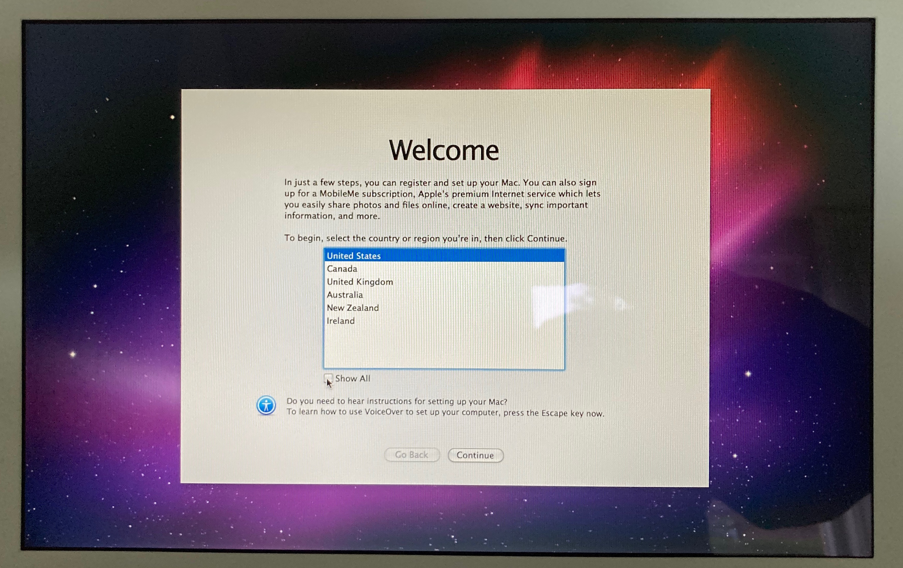
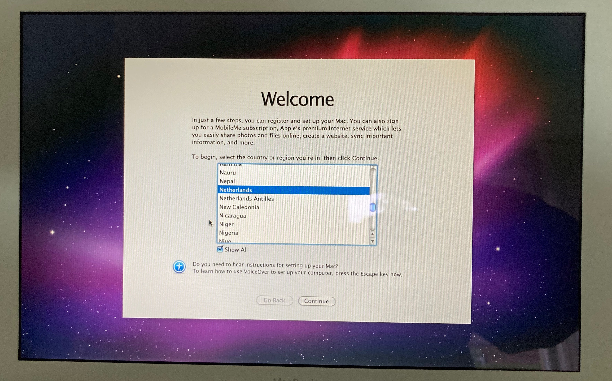

# Opstarten Apple MacBook

De MacBook komt als factory installed. Dus helmaal schoon, alsof je hem net uit de winkel hebt opgehaald. Dus je zult zelf een
gebruikers account aan moeten maken.

Start de MacBook op en wacht de introductie af. Daarna komt eerst een scherm met de taal selectie, waarin je de gebruikersvoorwaarden wilt zien.

## Welcome
Als eerste opent een scherm met _Welcome_

- Gebruik de check box **Show All**
- Zoek nu **Nederlands** op  
  _Ze staan op alphabetische volgorde_
- Click op **Continue**

De volgende stappen zijn mij zo 123 niet meer bekend, voor deze versie van OS-X. Je mag me altijd even bellen, om er samen doorheen te lopen. Liefst wel even met een iPhone / iPad, zodat we via FaceTime kunnen bellen, zodat ik even mee kan kijken, hoe de schermen er uit zien. Als FaceTime niet lukt, mag ook via WhatsApp beeld bellen.

## [Installatie Mac OS X Snow Leopard Update](install-osx-update-10.6.8.md)
Nadat het account is aangemaakt, moet je als eerste het besturingssysteem updaten naar de laatste versie. Dit is nog niet gedaan, omdat er daarvoor een account aangemaakt moest worden. En het idee was een af fabriek MacBook over te dragen. Dus zonder dat er accounts aangemaakt zijn.
Lees hoe dit gaat onder [Installatie Mac OS X Snow Leopard Update](install-osx-update-10.6.8.md).
